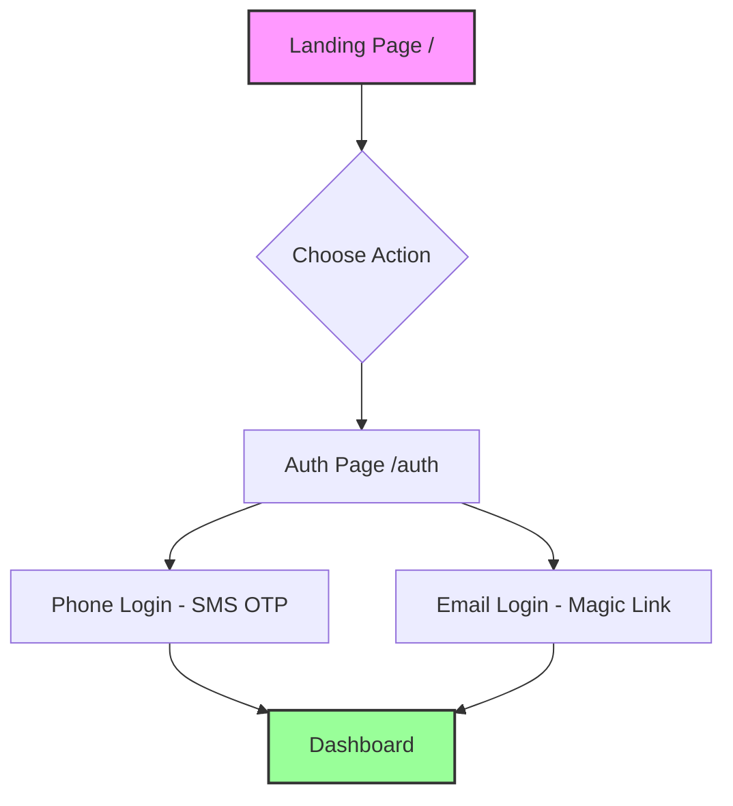
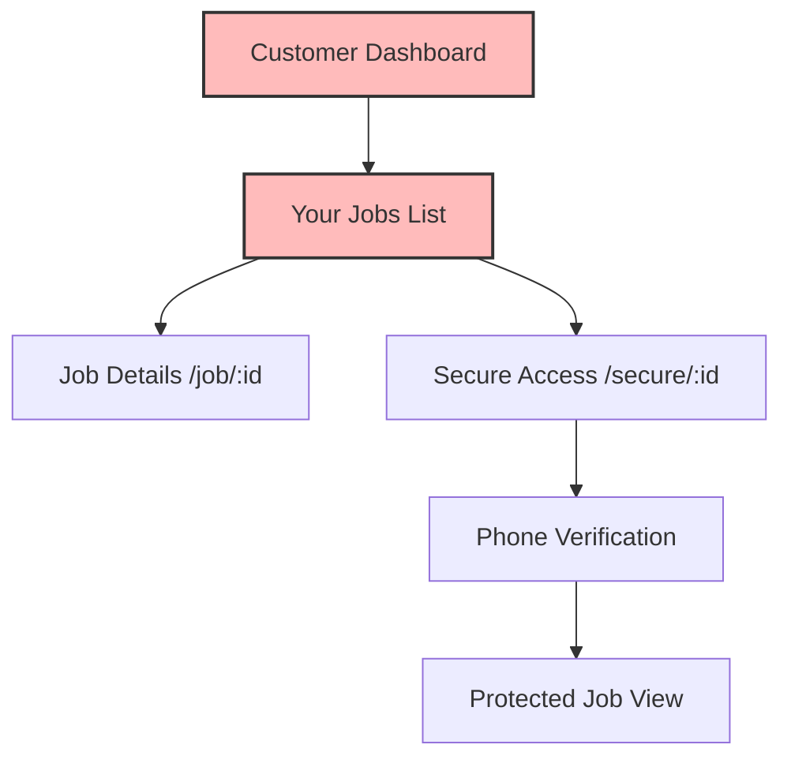
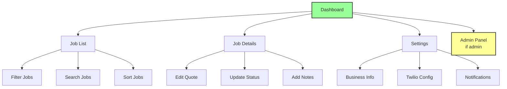
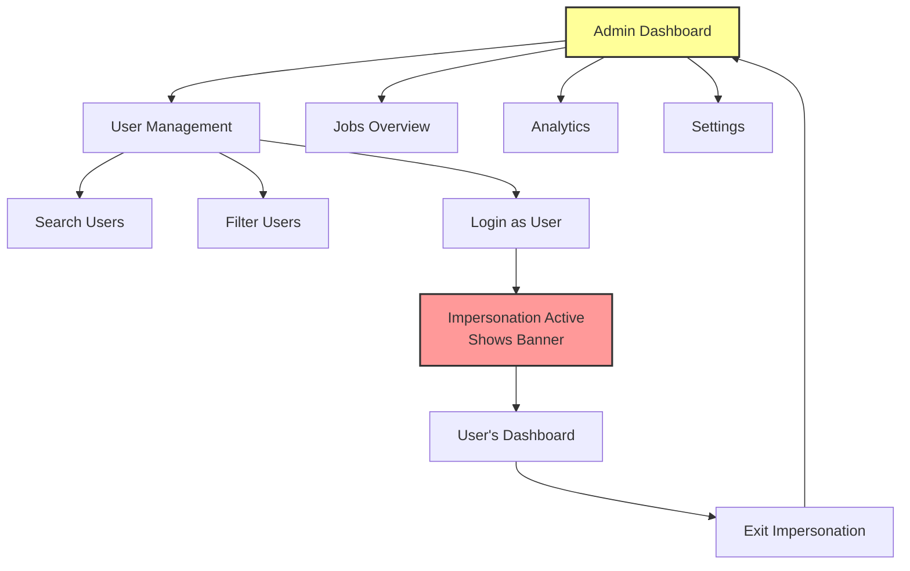
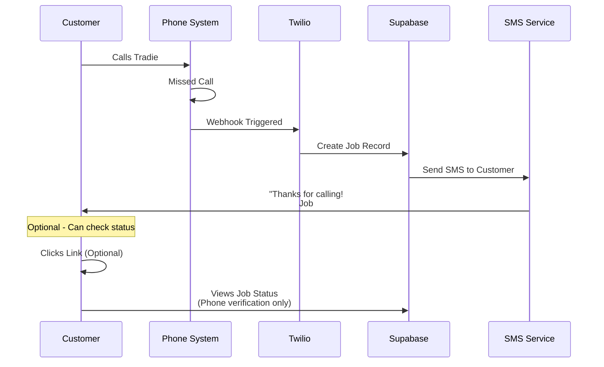
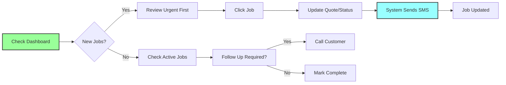
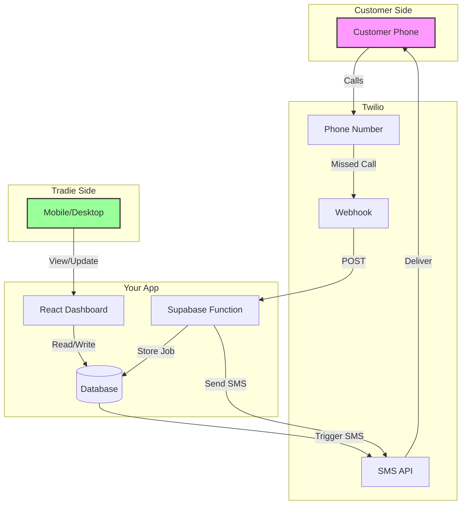
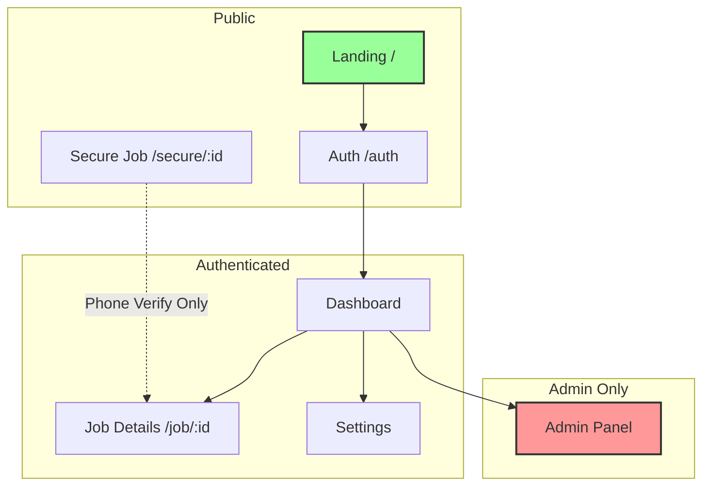
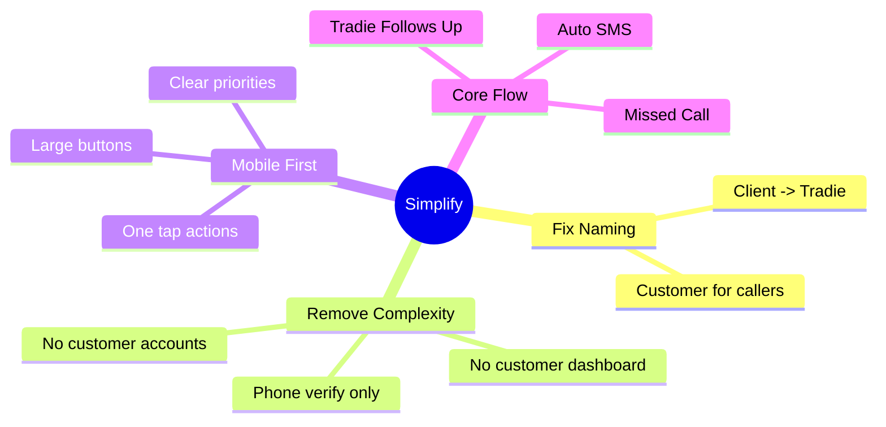
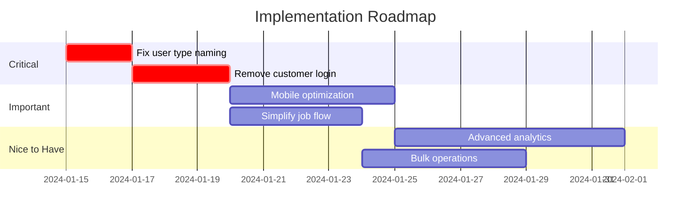

# User Flow Diagrams (Mermaid)

## How to View These Diagrams

### Option 1: VS Code (Recommended)
1. Install the "Markdown Preview Mermaid Support" extension
2. Open this file and press `Cmd+Shift+V` (Mac) or `Ctrl+Shift+V` (Windows)
3. Diagrams will render automatically!

### Option 2: GitHub
- Just push this file - GitHub renders Mermaid automatically

### Option 3: Online
- Copy any diagram to [mermaid.live](https://mermaid.live)

---

## Current System Flows

### 1. New Visitor Flow

### 2. Customer Flow (Currently Broken - They shouldn't need login!)

### 3. Tradie Business Owner Flow

### 4. Admin Flow

---

## 🎯 Proposed Simplified Flows

### 1. Customer Journey (No Login Required!)

### 2. Tradie Daily Workflow

### 3. System Architecture Overview

### 4. Simplified Page Access

---

## Key Improvements Needed

---

## Implementation Priority

